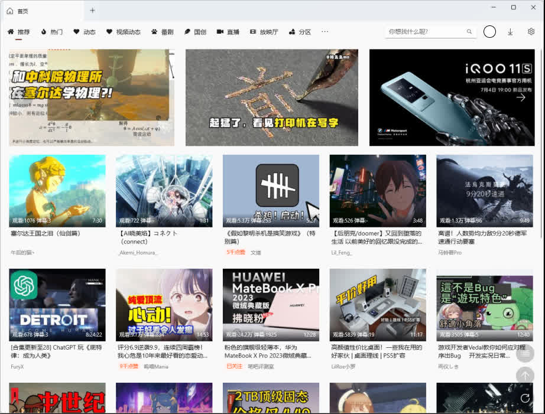

<!-- # BiliLite

由于个人原因，该项目停止维护，有兴趣的可以自行Fork维护。

其他客户端推荐：

@Richasy云之幻大佬开发的UWP，很好看也很好用

https://github.com/Richasy/Bili.Uwp

哔哩哔哩官方客户端，现在体验也很好了，建议大家去试试

https://app.bilibili.com/

感谢大家6年多以来的支持。 -->

# BiliLite

> BiliBili第三方UWP客户端

从逍遥橙子大佬那fork出来

https://github.com/xiaoyaocz/biliuwp-lite

## 下载

https://github.com/ywmoyue/biliuwp-lite/releases

## 安装

https://github.com/ywmoyue/biliuwp-lite/blob/master/document/install-readme.md

## 讨论

https://github.com/ywmoyue/biliuwp-lite/discussions

## 截图




## 构建

* 版本发布可能不够及时，有些问题可能dev分支修复了却没发版本，有一定编程基础的可以自行Clone项目下来自己构建 

### 步骤
1. 使用Terminal运行
```sh
git clone -b dev https://github.com/ywmoyue/biliuwp-lite.git
```
2. 双击项目中的BiliLite.sln文件使用VisualStudio2019以上的版本打开
3. 右键点击BiliLite.Packages项目，选择设为启动项目
4. 按ctrl+f5开始构建并执行，成功后关闭VS即可

### 鸣谢

[](https://github.com/ywmoyue/biliuwp-lite/graphs/contributors)
