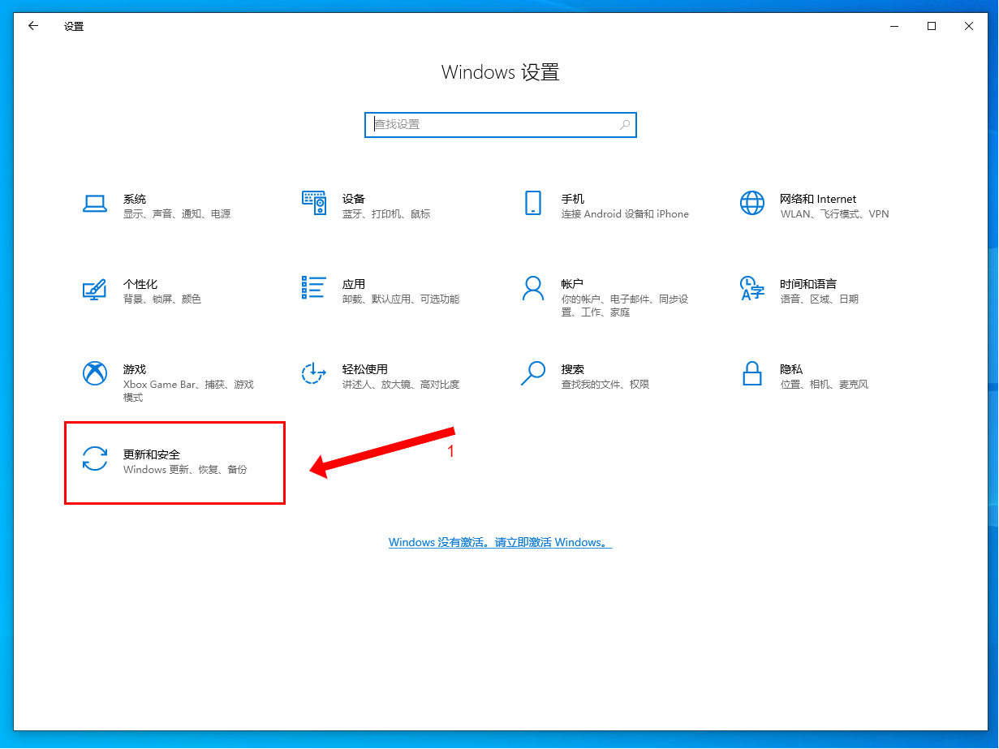
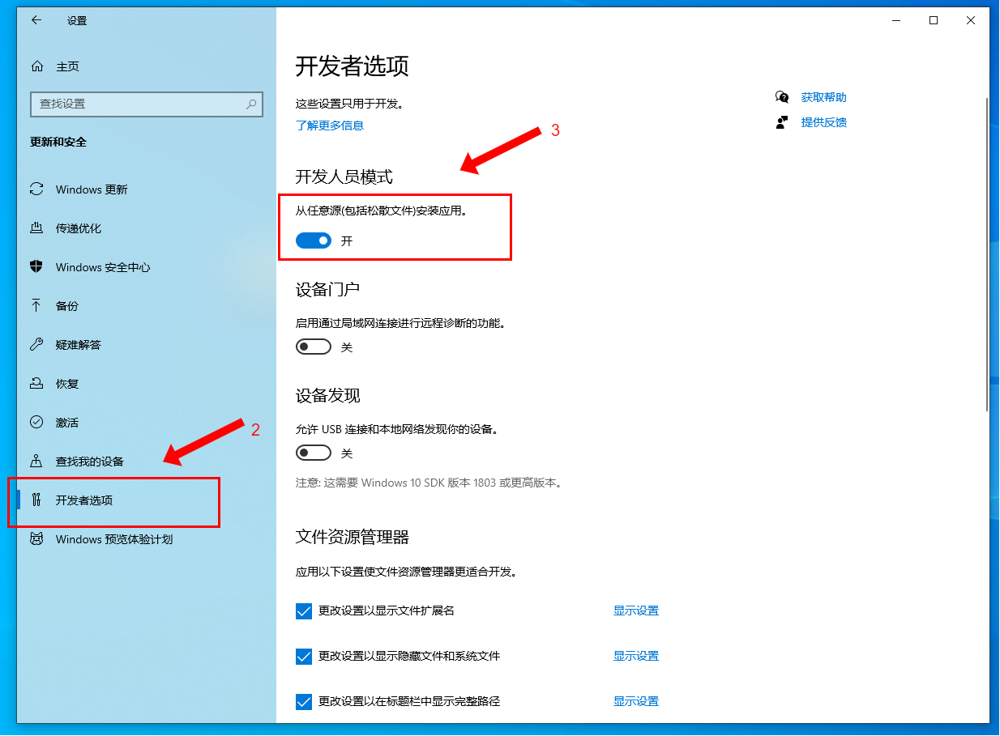
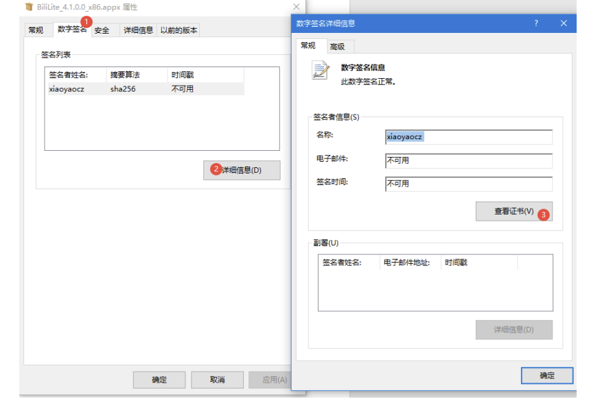
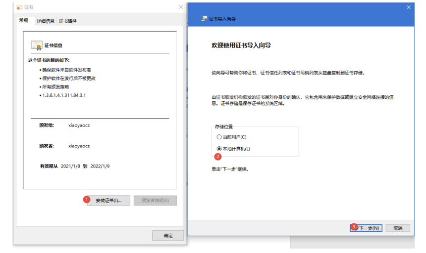
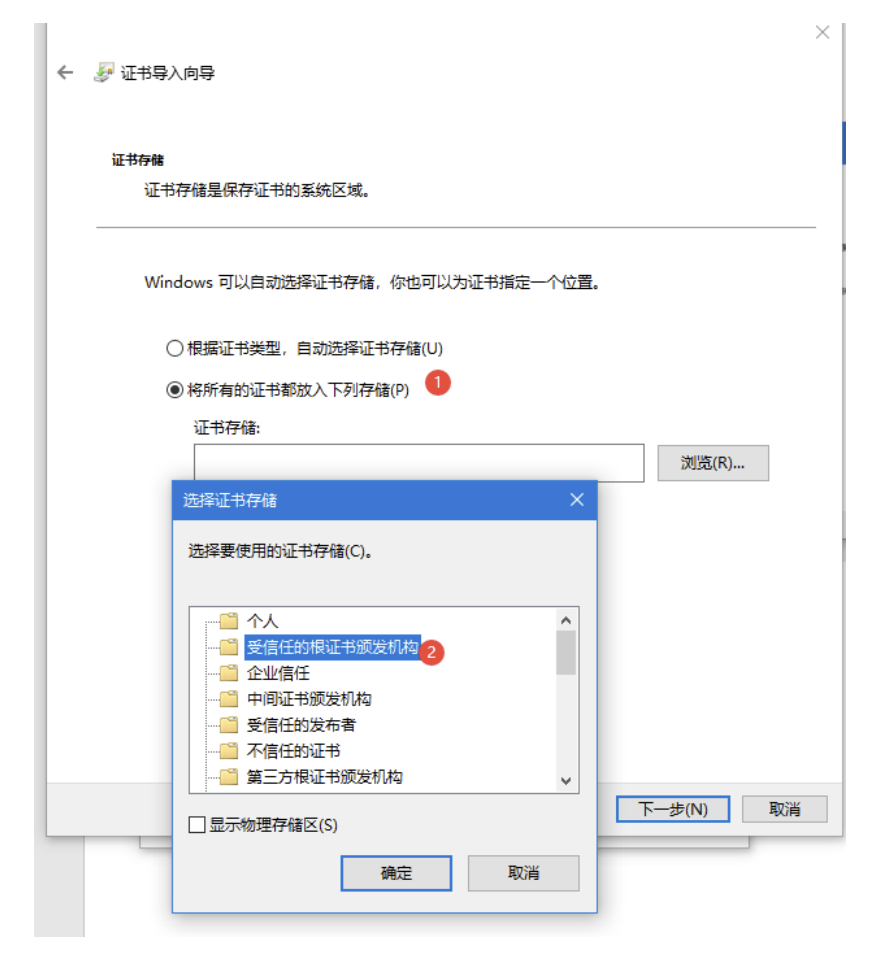
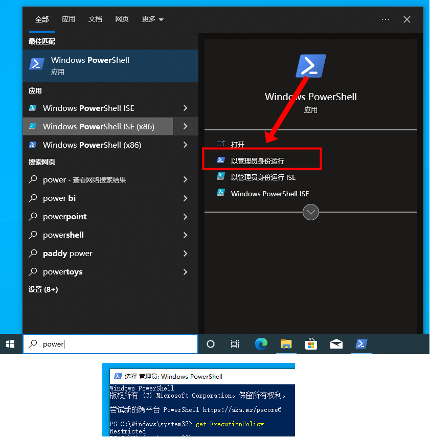
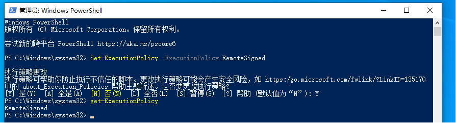
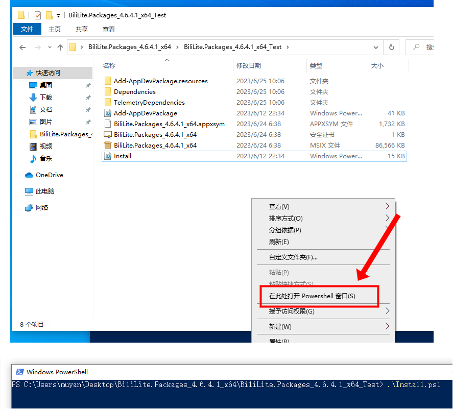
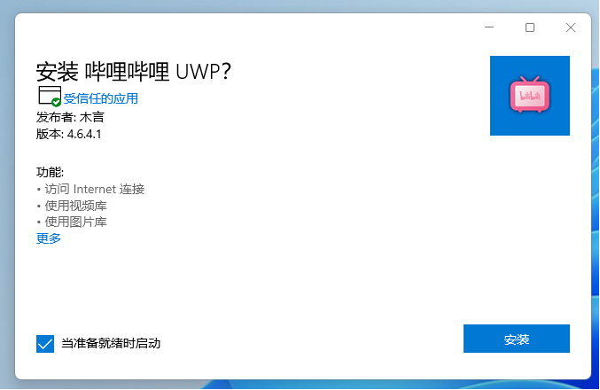

# Biliuwp-lite安装教程

## 安装要求系统版本信息

1. Windows10 1903及以上

## Windows10 安装教程

> Win10系统请勿直接运行msix安装包进行安装，可能导致奇怪的问题
> Win11系统请往下翻

### 启用开发者模式

1. 如图所示在系统设置中操作

### 安装证书

1、双击打开.cer 证书文件。如果没有.cer 证书文件则右键.appx 文件-属性-数字签名-详细
信息-查看证书

2、点击安装证书，将证书安装到本地计算机

3、选择受信任的根证书颁发机构，下一步，完成即可

### 检查脚本执行权限

1. 以管理员身份启动powershell

2. 执行命令`get-ExecutionPolicy`, 如果输出`Restricted`表示禁止执行脚本,如果输出`RemoteSigned`表示可以执行脚本

3. 执行命令`Set-ExecutionPolicy -ExecutionPolicy RemoteSigned`并按Y启用脚本执行权限

### 运行安装脚本

1. 在安装包解压目录中按住键盘shift并单击鼠标右键打开powershell，执行脚本`.\Install.ps1`开始安装

## Windows11 安装教程

### 安装证书

1、双击打开.cer 证书文件。如果没有.cer 证书文件则右键.appx 文件-属性-数字签名-详细
信息-查看证书

2、点击安装证书，将证书安装到本地计算机

3、选择受信任的根证书颁发机构，下一步，完成即可

### 运行Msix安装包

